# Dokumentasi UML - Project E-Tutor (Rebuild v2)

Dokumen ini berisi dokumentasi teknis UML yang telah dibangun ulang berdasarkan use case diagram terbaru. Dokumentasi ini mencakup **14 Use Case** dengan Activity Diagram dan Sequence Diagram untuk masing-masing, serta Class Diagram dan ERD yang komprehensif.

---

## 1. Use Case Diagram

Diagram ini merepresentasikan interaksi 4 aktor utama dengan **14 fitur** sistem.

```mermaid
useCaseDiagram
    actor "Peserta" as P
    actor "Tutor" as T
    actor "Admin" as A
    actor "Kaprodi" as K

    package "Aplikasi Forum Diskusi Mahasiswa (E-Tutor)" {
        usecase "Registrasi" as UC1
        usecase "Login" as UC2
        usecase "Melihat Informasi Kelas" as UC3
        usecase "Mendaftar Kelas" as UC4
        usecase "Melihat Aktivitas" as UC5
        usecase "Pengajuan Tutor" as UC6
        usecase "Cek Status Pengajuan" as UC7
        usecase "Kelola Jadwal Mengajar" as UC8
        usecase "Seleksi Pendaftar Kelas" as UC9
        usecase "Upload Bukti Mengajar" as UC10
        usecase "Generate Surat Rekomendasi" as UC11
        usecase "Validasi Pengajuan Tutor" as UC12
        usecase "Validasi Pengajuan Achievement" as UC13
        usecase "Manage & Hapus Kelas" as UC14
    }

    P --> UC1
    P --> UC2
    P --> UC3
    P --> UC4
    P --> UC5
    P --> UC6
    P --> UC7

    T --> UC2
    T --> UC8
    T --> UC9
    T --> UC10
    T --> UC11
    T --> UC7

    A --> UC2
    A --> UC13
    A --> UC14

    K --> UC2
    K --> UC12
```

---

## 2. Activity Diagrams (14)

### 1. Registrasi
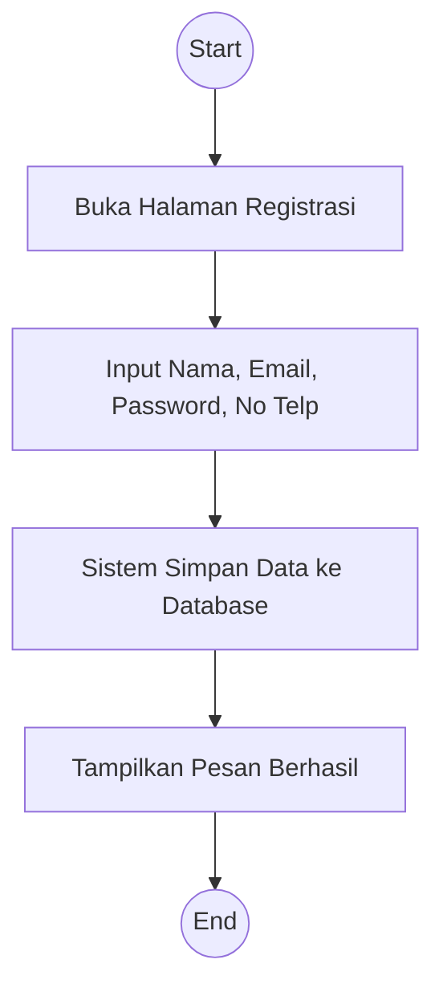

### 2. Login
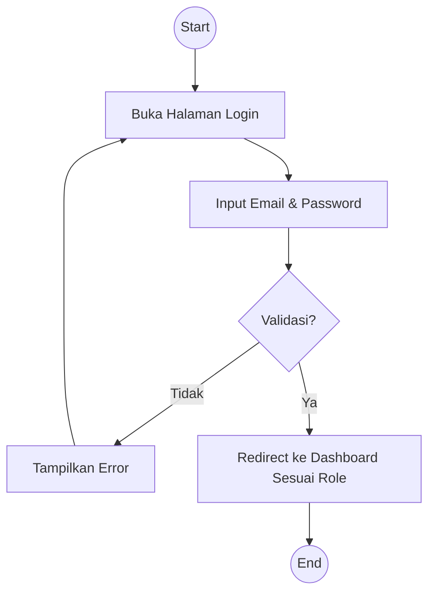

### 3. Melihat Informasi Kelas (Peserta)
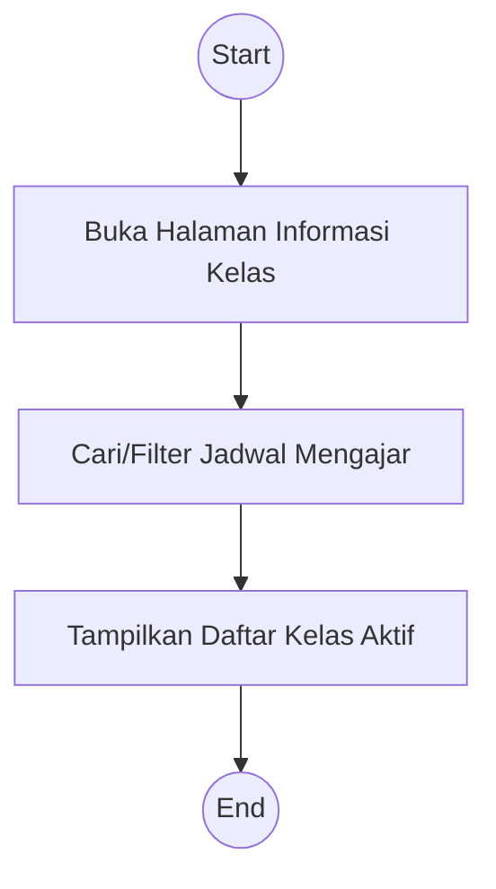

### 4. Mendaftar Kelas (Peserta)
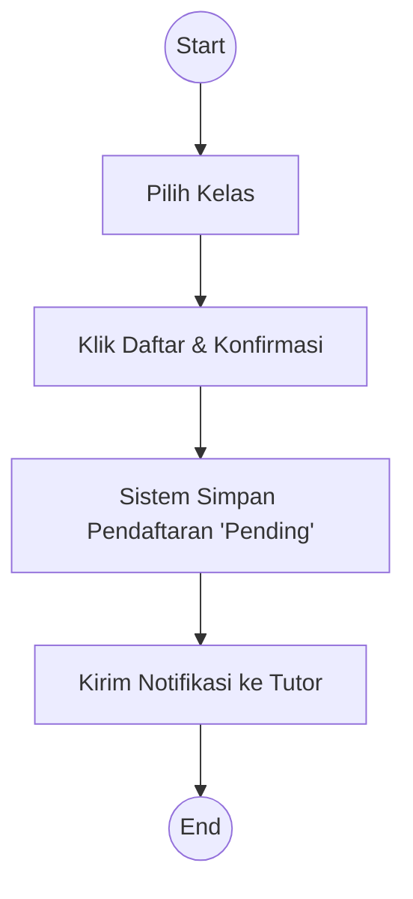

### 5. Melihat Aktivitas (Peserta)
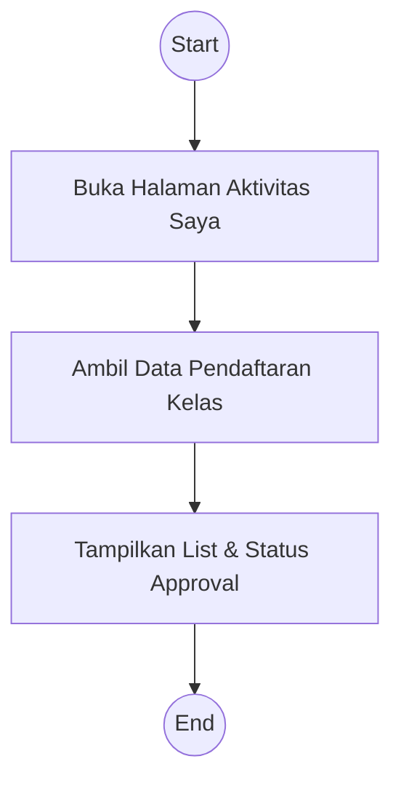

### 6. Pengajuan Tutor (Peserta)
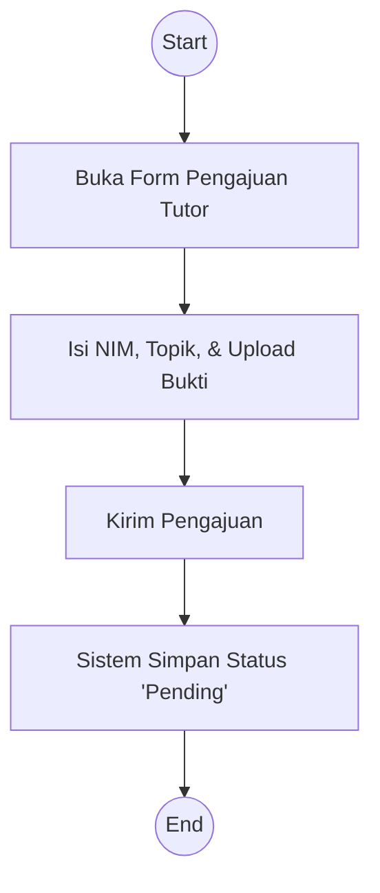

### 7. Cek Status Pengajuan (Peserta/Tutor)
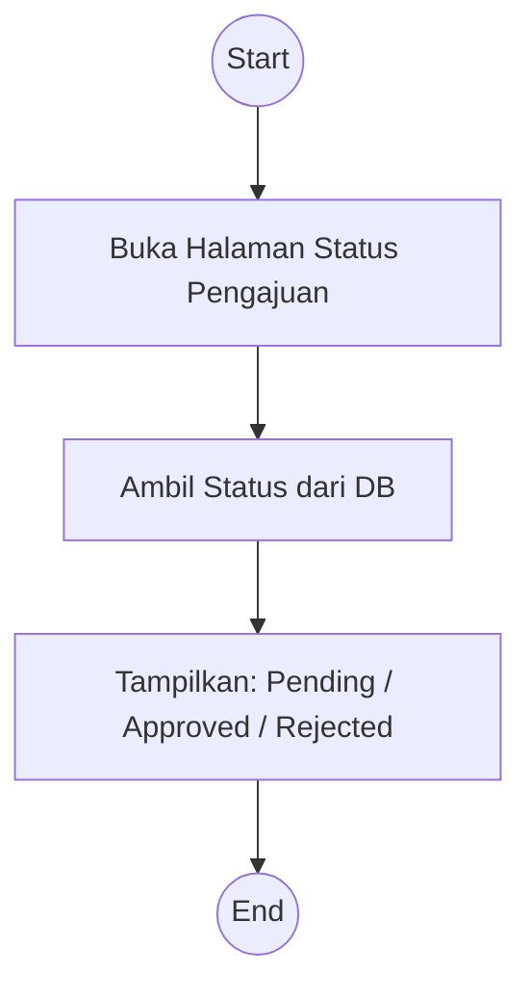

### 8. Kelola Jadwal Mengajar (Tutor)
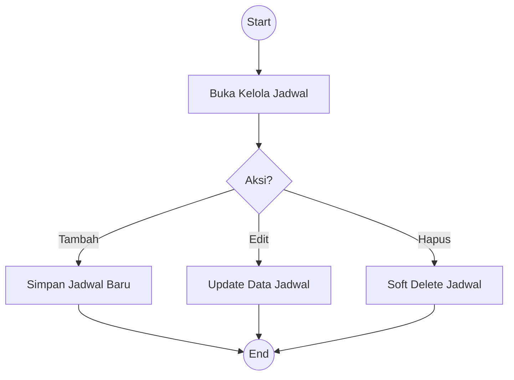

### 9. Seleksi Pendaftar Kelas (Tutor)
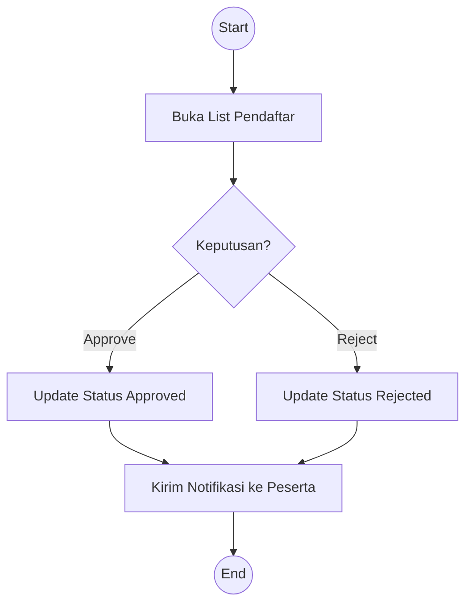

### 10. Upload Bukti Mengajar / Pengajuan Achievement (Tutor)
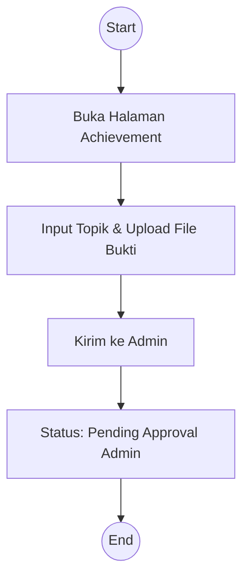

### 11. Generate Surat Rekomendasi (Tutor)
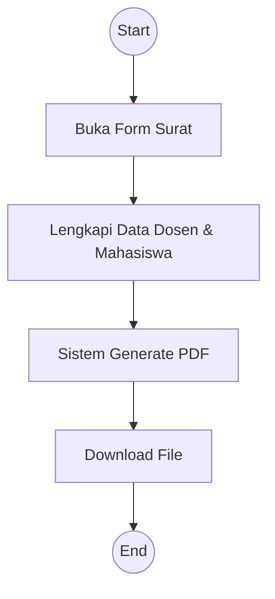

### 12. Validasi Pengajuan Tutor (Kaprodi)
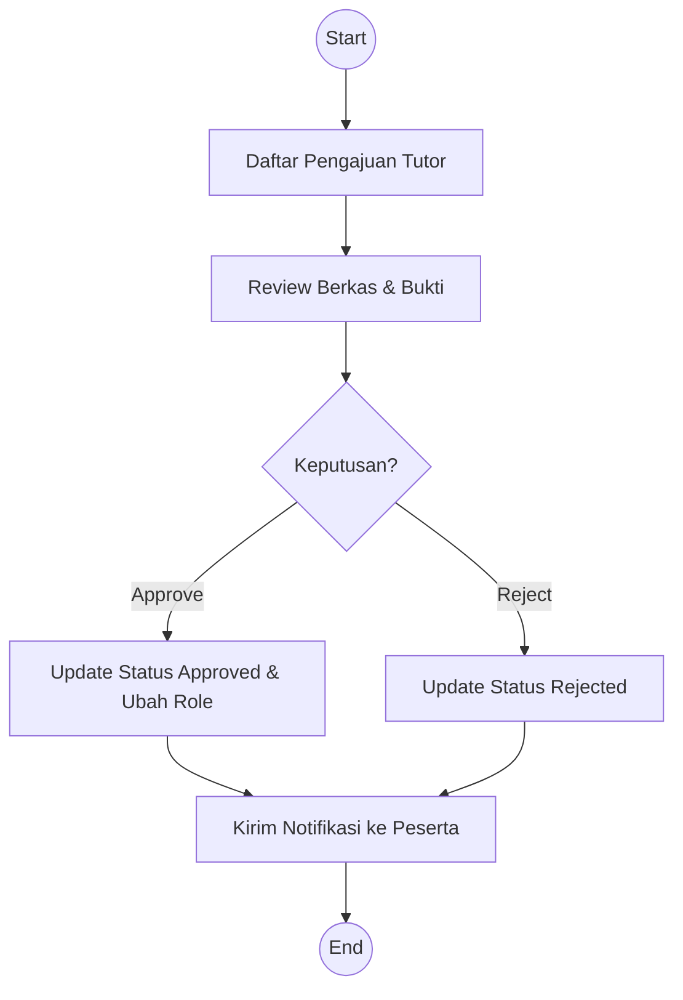

### 13. Validasi Pengajuan Achievement (Admin)
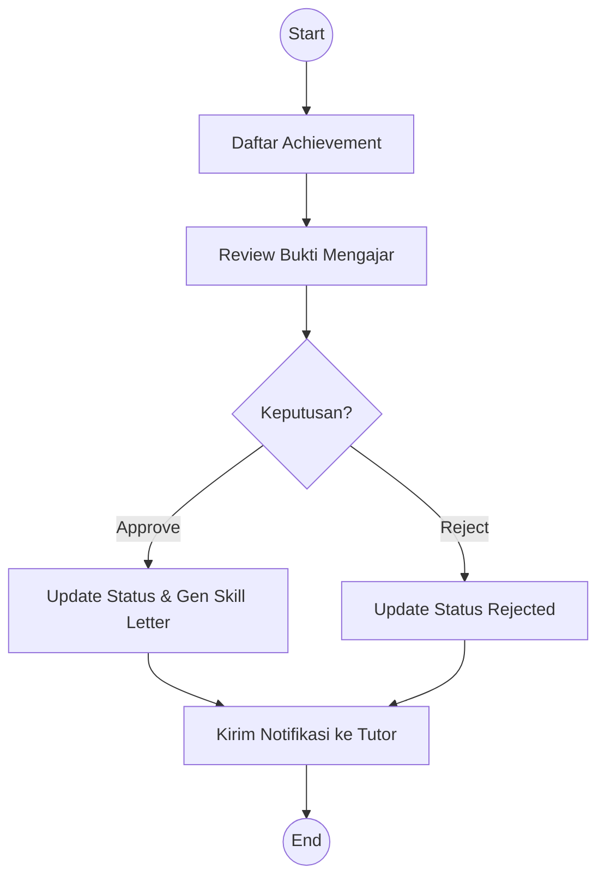

### 14. Manage & Hapus Kelas (Admin)
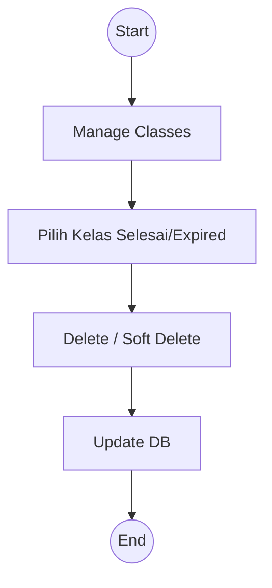

---

## 3. Sequence Diagrams (14)

### 1. Registrasi
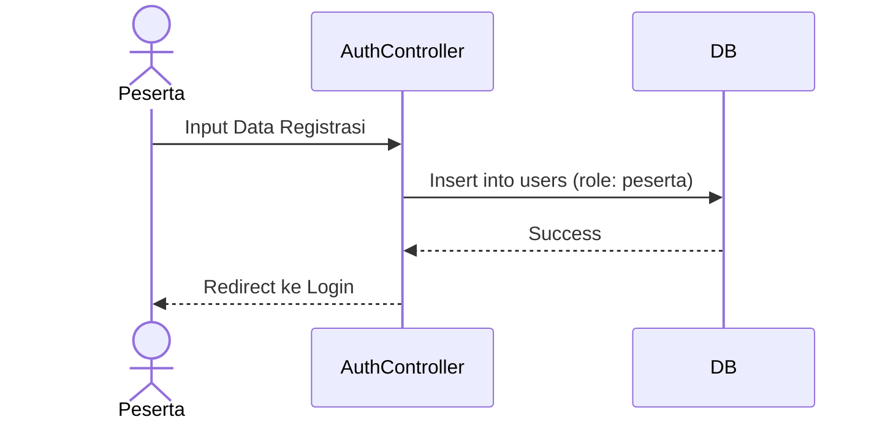

### 2. Login
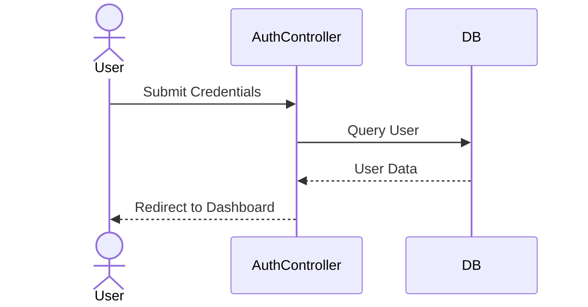

### 3. Melihat Informasi Kelas
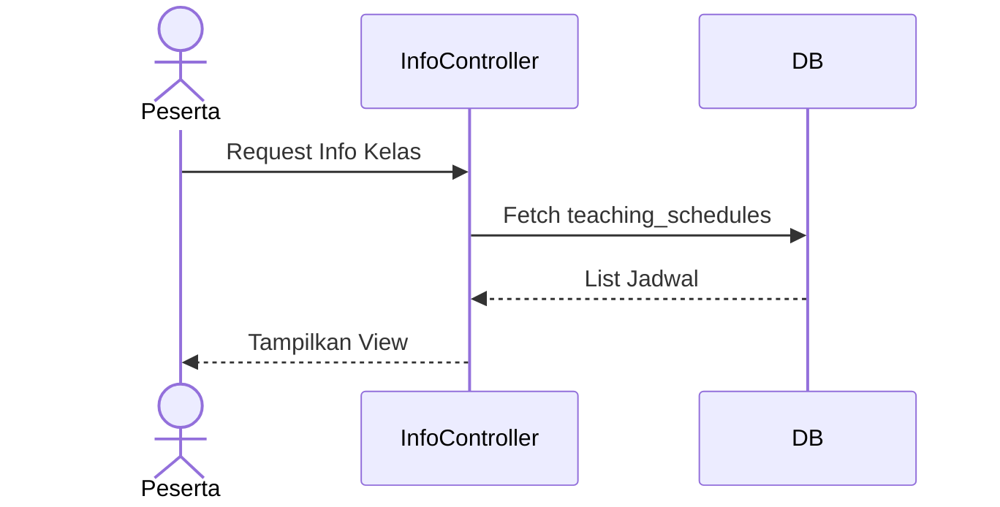

### 4. Mendaftar Kelas
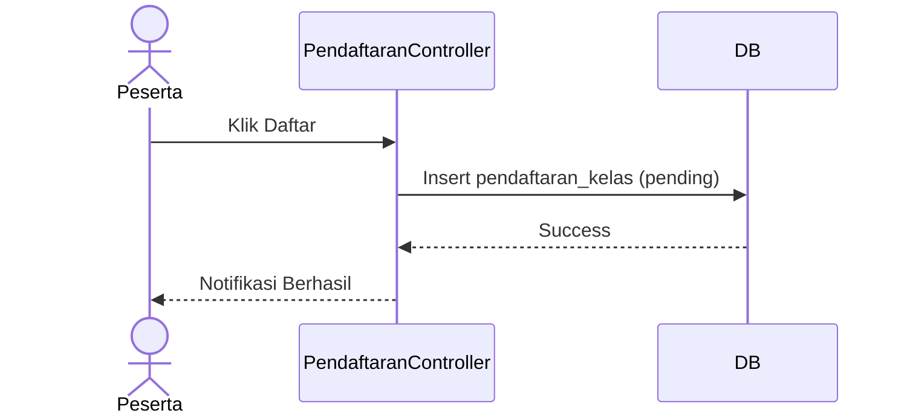

### 5. Melihat Aktivitas
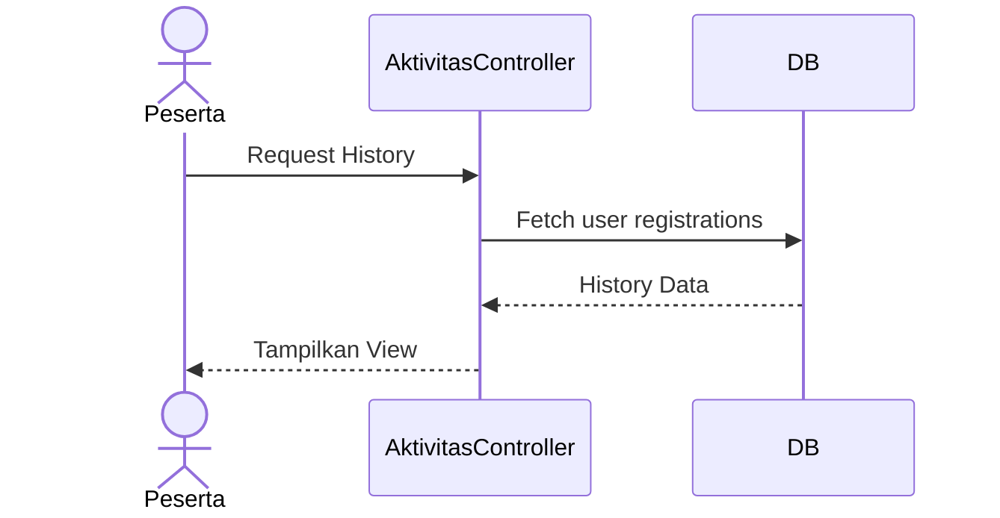

### 6. Pengajuan Tutor
```mermaid
sequenceDiagram
    actor Peserta
    participant PengajuanController
    participant DB
    Peserta->>PengajuanController: Submit Form Pengajuan
    PengajuanController->>DB: Insert into pengajuan_tutor (pending)
    DB-->>PengajuanController: Success
    PengajuanController-->>Peserta: Tampilkan Status Pending
```

### 7. Cek Status Pengajuan
```mermaid
sequenceDiagram
    actor User
    participant PengajuanController
    participant DB
    User->>PengajuanController: Get Latest Status
    PengajuanController->>DB: Fetch from pengajuan_tutor
    DB-->>PengajuanController: Status Data
    PengajuanController-->>User: Display Status
```

### 8. Kelola Jadwal Mengajar
```mermaid
sequenceDiagram
    actor Tutor
    participant JadwalController
    participant DB
    Tutor->>JadwalController: Add/Edit/Delete Schedule
    JadwalController->>DB: Update teaching_schedules
    DB-->>JadwalController: Result
    JadwalController-->>Tutor: Refresh Jadwal
```

### 9. Seleksi Pendaftar Kelas
```mermaid
sequenceDiagram
    actor Tutor
    participant ListPendaftarController
    participant DB
    Tutor->>ListPendaftarController: Approve/Reject(id)
    ListPendaftarController->>DB: Update pendaftaran_kelas
    DB-->>ListPendaftarController: Success
    ListPendaftarController-->>Tutor: Refresh List
```

### 10. Upload Bukti Mengajar (Achievement)
```mermaid
sequenceDiagram
    actor Tutor
    participant AchievementController
    participant DB
    Tutor->>AchievementController: Upload Bukti Mengajar
    AchievementController->>DB: Insert into achievements
    DB-->>AchievementController: Success
    AchievementController-->>Tutor: Tampilkan List Achievement
```

### 11. Generate Surat Rekomendasi
```mermaid
sequenceDiagram
    actor Tutor
    participant LetterController
    participant PDFEngine
    Tutor->>LetterController: Request PDF
    LetterController->>PDFEngine: Build Template
    PDFEngine-->>LetterController: PDF File
    LetterController-->>Tutor: Download PDF
```

### 12. Validasi Pengajuan Tutor
```mermaid
sequenceDiagram
    actor Kaprodi
    participant AccPengajuanController
    participant DB
    Kaprodi->>AccPengajuanController: Approve(id)
    AccPengajuanController->>DB: Update status & Change Role to Tutor
    DB-->>AccPengajuanController: Success
    AccPengajuanController-->>Kaprodi: Refresh Page
```

### 13. Validasi Pengajuan Achievement
```mermaid
sequenceDiagram
    actor Admin
    participant AdminAchievementController
    participant DB
    Admin->>AdminAchievementController: Approve(id)
    AdminAchievementController->>DB: Update status & Create SkillLetter
    DB-->>AdminAchievementController: Success
    AdminAchievementController-->>Admin: Refresh Page
```

### 14. Manage & Hapus Kelas
```mermaid
sequenceDiagram
    actor Admin
    participant AdminClassController
    participant DB
    Admin->>AdminClassController: Delete Class(id)
    AdminClassController->>DB: Soft Delete Schedule
    DB-->>AdminClassController: Success
    AdminClassController-->>Admin: Refresh List
```

---

## 4. Class Diagram

Diagram ini merepresentasikan struktur class (Model) dalam sistem dan hubungannya.

```mermaid
classDiagram
    User "1" -- "0..*" PengajuanTutor
    User "1" -- "0..*" TeachingSchedule
    User "1" -- "0..*" PendaftaranKelas
    User "1" -- "0..*" Achievement
    TeachingSchedule "1" -- "0..*" PendaftaranKelas
    Achievement "1" -- "0..1" SkillLetter
    
    class User {
        +int id
        +string role
        +login()
        +register()
    }
    class PengajuanTutor {
        +int id
        +string status
    }
    class Achievement {
        +int id
        +string status
    }
```

---

## 5. Entity Relationship Diagram (ERD)

Diagram ini merepresentasikan struktur tabel database dan relasi antar entitas.

```mermaid
erDiagram
    users ||--o{ pengajuan_tutor : "submit"
    users ||--o{ teaching_schedules : "create"
    users ||--o{ pendaftaran_kelas : "enroll"
    users ||--o{ achievements : "upload"
    teaching_schedules ||--o{ pendaftaran_kelas : "has"
    achievements ||--o| skill_letters : "generates"
```

---
*Dokumentasi ini telah disesuaikan menjadi 14 use case sesuai permintaan terbaru.*
